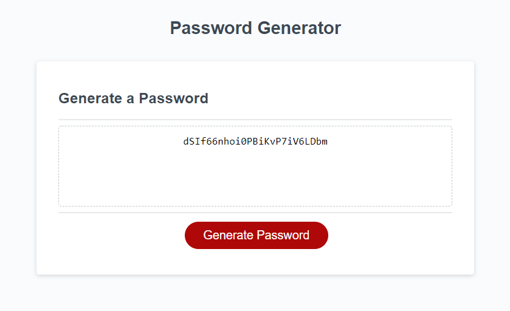

# password_generator

## Random Password Generator
This application collects preferences from the user and generates a random password based on the following criteria:
- Include or not lowercase letters
- Include or not uppercase letters
- Include or not numeric characters
- Include or not special characters
- At least one character set must be selected
- The user sets the length of the password, between 8 and 128 characters

## Links
The deployed website can be found [here](https://benfok.github.io/password_generator/)

The repository in GitHub is [here](https://github.com/benfok/password_generator)

## Screenshot
Here is a screenshot of my finished page. Some key details and learnings are below.

## Details and Learnings
- This application leverages JavaScript confirm() and prompt() methods to collect the user input. This is not the most user friendly way to collect this information. A form would be better.
- Storing the character sets within specific arrays and appending them together to form a string of available characters based on the user choices was a clean approach and allowed for easy validation that at least one character set was selected.
- I needed to convert the prompt input to a number for validation to ensure a number between 8-128 was entered. Again a better UX could be designed here to avoid the pop-ups or avoid them completely restarting. 
- Once I have the password length and the user specific string of characters, I loop through the string for the desired length and select random characters to form the password.

